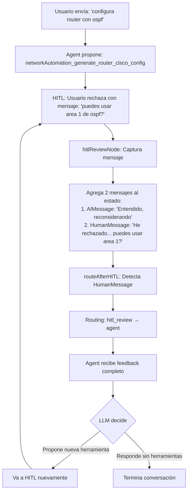

# Implementación de Reject con Feedback - HITL

## 🎯 Objetivo

Implementar el manejo correcto de **`reject`** según la documentación oficial de LangChain, permitiendo que el agente reciba el feedback del usuario y proponga alternativas en lugar de simplemente terminar.

---

## 📊 Comparación: Antes vs. Después

### ❌ **Comportamiento ANTERIOR:**

```
Usuario rechaza: "puedes usar area 1 de ospf?"
    ↓
Backend: Descarta el mensaje del usuario
    ↓
Backend: Retorna "La ejecución fue rechazada. ¿En qué más puedo ayudarte?"
    ↓
FIN (el agente termina)
```

### ✅ **Comportamiento NUEVO (según LangChain):**

```
Usuario rechaza: "puedes usar area 1 de ospf?"
    ↓
Backend: Captura el mensaje del usuario
    ↓
Backend: Agrega HumanMessage con el feedback
    ↓
Agent recibe: "He rechazado la herramienta propuesta. puedes usar area 1 de ospf?"
    ↓
LLM DECIDE:
  - Propone nueva herramienta con area 1 → Vuelve a HITL
  - Responde sin herramientas → FIN
```

---

## 🔧 Cambios Implementados

### **1. Backend: `agent.ts`**

#### **Cambio 1: Interfaz `HumanDecision`**

```typescript
// ANTES
interface HumanDecision {
  decisions?: Array<{ type: "approve" | "reject" | "edit" }>;
}

// DESPUÉS
interface HumanDecision {
  decisions?: Array<{
    type: "approve" | "reject" | "edit";
    message?: string; // ⬅️ NUEVO: Feedback del usuario
  }>;
}
```

#### **Cambio 2: Función `hitlReviewNode`**

```typescript
// ANTES
if (decision === "reject") {
  console.log("❌ Herramienta rechazada por el usuario");
  return {
    messages: [
      new AIMessage({
        content:
          "La ejecución de la herramienta fue rechazada por el usuario. ¿En qué más puedo ayudarte?",
      }),
    ],
  };
}

// DESPUÉS
if (decision === "reject") {
  console.log("❌ Herramienta rechazada por el usuario");

  const feedbackText = feedbackMessage
    ? `He rechazado la herramienta propuesta. ${feedbackMessage}`
    : "He rechazado la herramienta propuesta. Por favor, considera un enfoque diferente.";

  console.log(
    `💬 Feedback del usuario: "${feedbackMessage || "(sin mensaje)"}"`,
  );
  console.log(
    `↻ Devolviendo feedback al agente para que proponga alternativas`,
  );

  return {
    messages: [
      // Reemplaza el mensaje AI con tool_calls
      new AIMessage({
        content: "Entendido, déjame reconsiderar el enfoque.",
      }),
      // Agrega el feedback del usuario
      new HumanMessage({
        content: feedbackText,
      }),
    ],
  };
}
```

#### **Cambio 3: Función `routeAfterHITL`**

```typescript
// ANTES
function routeAfterHITL(state: AgentState): "tools" | typeof END {
  // ...
  if (lastMessage instanceof AIMessage && !lastMessage.tool_calls?.length) {
    console.log("↪️ Routing: hitl_review → END (herramienta rechazada)");
    return END; // ❌ Terminaba aquí
  }
  return "tools";
}

// DESPUÉS
function routeAfterHITL(state: AgentState): "tools" | "agent" {
  // Si el último mensaje es HumanMessage, hubo un reject con feedback
  if (lastMessage instanceof HumanMessage) {
    console.log(
      "↪️ Routing: hitl_review → agent (rechazado con feedback del usuario)",
    );
    return "agent"; // ✅ Vuelve al agente
  }

  // Si es AIMessage sin tool_calls, también es un reject
  if (lastMessage instanceof AIMessage && !lastMessage.tool_calls?.length) {
    console.log(
      "↪️ Routing: hitl_review → agent (rechazado, volviendo para reconsiderar)",
    );
    return "agent"; // ✅ Vuelve al agente
  }

  return "tools";
}
```

#### **Cambio 4: Arquitectura del Grafo**

```typescript
// ANTES
/*
 * START → agent → hitl_review → tools → agent → ... → END
 *                      ↓
 *                     END (si rechazado)
 */

// DESPUÉS
/*
 * START → agent → hitl_review → tools → agent → ... → END
 *                      ↓              ↑
 *                    agent ←──────────┘ (si rechazado, vuelve con feedback)
 */
```

---

### **2. Frontend: Ya estaba listo ✅**

El frontend en `inbox-item-input.tsx` **ya estaba enviando el mensaje** correctamente:

```typescript
const handleReject = async (index: number, reason: string) => {
  const decisions: HITLResponse["decisions"] = hitlRequest.actionRequests.map(
    (_, i) =>
      i === index
        ? { type: "reject", message: reason } // ⬅️ Ya captura el mensaje
        : { type: "reject", message: "Rejected along with other actions" },
  );

  await stream.submit(null, {
    command: { resume: { decisions } },
  });
};
```

**No se requieren cambios en el frontend.**

---

## 🔄 Flujo Completo del Reject



---

## 🧪 Cómo Probar

1. **Inicia el backend:**

   ```bash
   cd mcp_client_langchain_network_agent
   npx @langchain/langgraph-cli dev
   ```

2. **Inicia el frontend:**

   ```bash
   cd agent-chat-ui-network-agent
   pnpm dev
   ```

3. **Prueba el flujo:**
   - Envía: "configura un router con OSPF"
   - El agente propondrá una herramienta
   - **RECHAZA** con el mensaje: "puedes usar area 1 de ospf?"
   - Observa que el agente **recibe el feedback** y propone una alternativa

---

## 📝 Logs Esperados

Cuando rechazas con mensaje:

```
🛑 HITL: Pausando para revisión de 1 herramienta(s)
   📋 Tools: networkAutomation_generate_router_cisco_config
   ✅ HITLRequest creado para Agent Chat UI
   📤 Human decision received: { decisions: [ { type: 'reject', message: 'puedes usar area 1 de ospf?' } ] }
   ❌ Herramienta rechazada por el usuario
   💬 Feedback del usuario: "puedes usar area 1 de ospf?"
   ↻ Devolviendo feedback al agente para que proponga alternativas

🔍 DEBUG routeAfterHITL:
   Total messages: X
   Last message type: HumanMessage
   Has tool_calls: false
   ↪️ Routing: hitl_review → agent (rechazado con feedback del usuario)

🔍 DEBUG callModel input:
   Total messages: X
   [X] HumanMessage: He rechazado la herramienta propuesta. puedes usar area 1 de ospf?
```

---

## 📚 Referencias

- [LangChain HITL Documentation](https://docs.langchain.com/oss/javascript/langchain/human-in-the-loop)
- [Handling Interrupts](https://docs.langchain.com/oss/javascript/langgraph/interrupts)

---

## ✅ Checklist de Implementación

- [x] Actualizar interfaz `HumanDecision` para incluir `message`
- [x] Modificar `hitlReviewNode` para capturar y agregar feedback
- [x] Actualizar `routeAfterHITL` para volver a `agent` en vez de `END`
- [x] Actualizar documentación del grafo
- [x] Verificar que frontend ya envía el mensaje (✅ ya estaba listo)
- [x] Sin errores de TypeScript

---

## 🎉 Resultado

Ahora el sistema cumple con la especificación de LangChain HITL:

> "A human decision then determines what happens next: the action can be approved as-is (approve), modified before running (edit), or **rejected with feedback (reject)**."

El `reject` ya no es un "stop", sino una **oportunidad para el agente de mejorar** basado en tu feedback.
